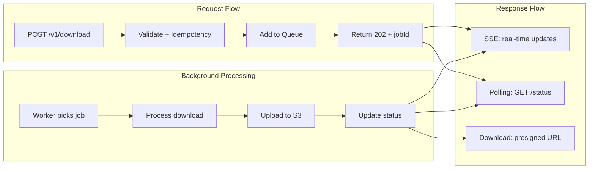
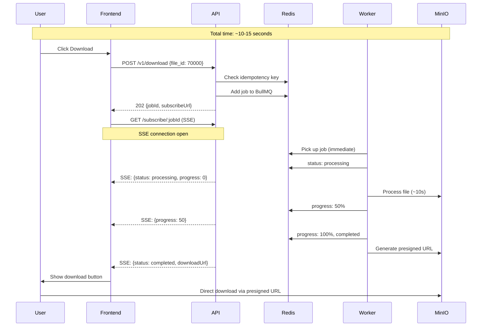
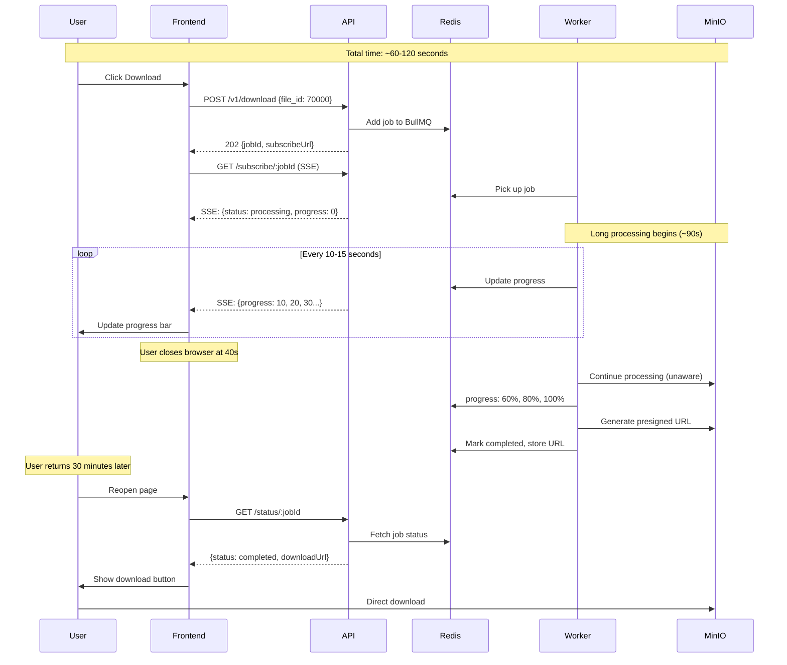
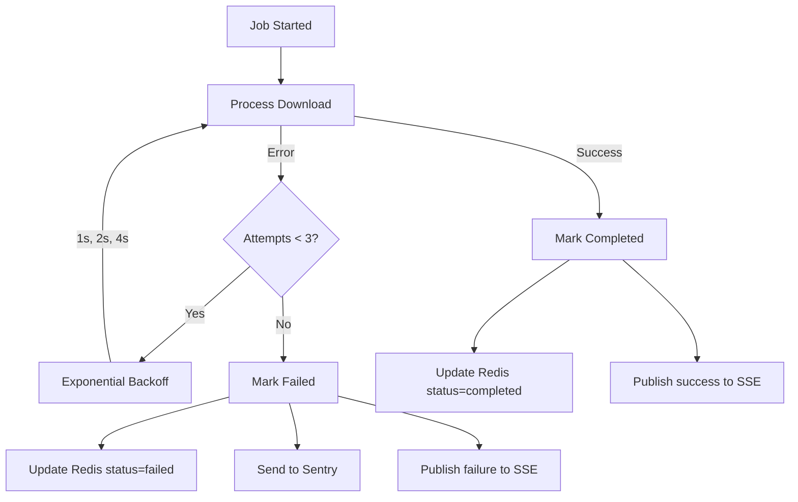
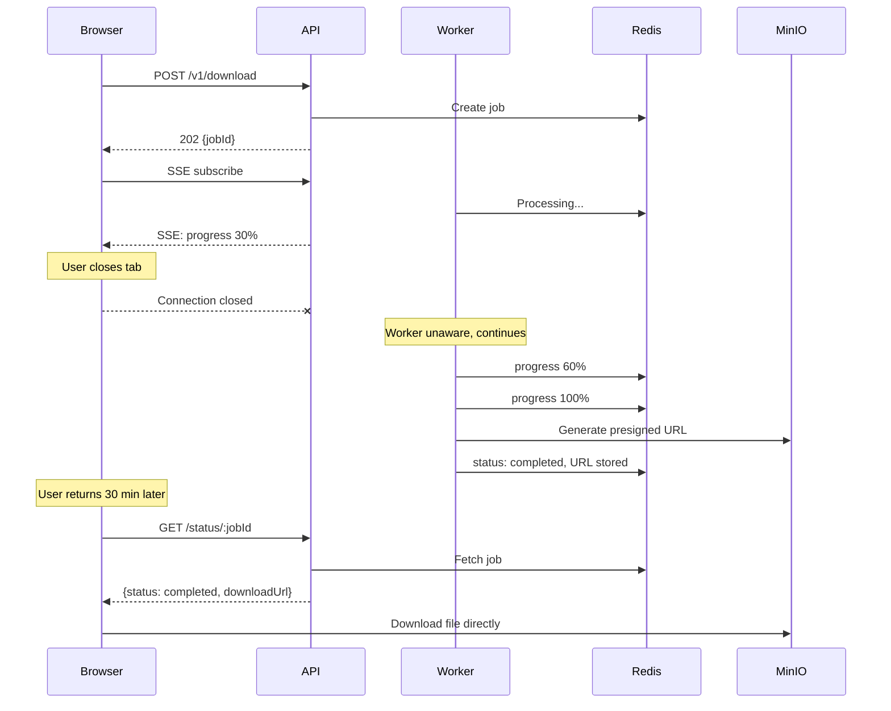
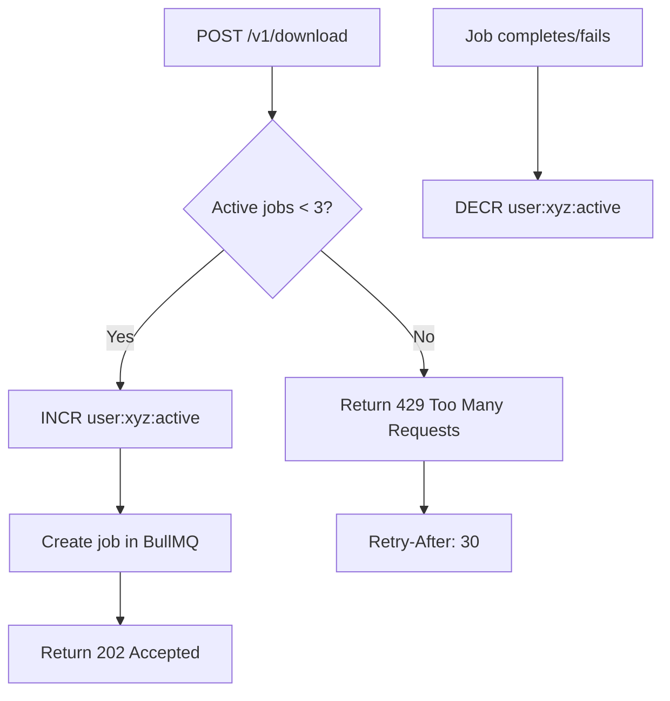
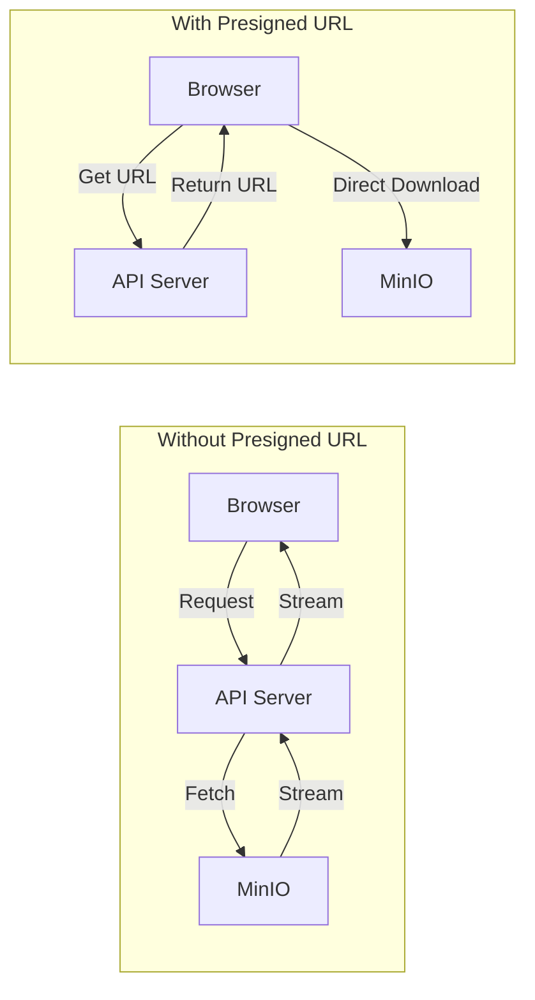
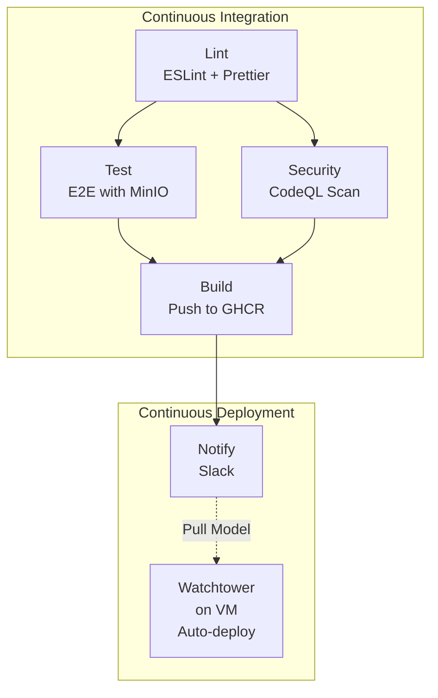

<!-- @format -->

# Long-Running Download Architecture Design

## System Architecture

### Visual Representation


### Component Overview



### Component Responsibilities

| Component    | Role                                               |
| ------------ | -------------------------------------------------- |
| **nginx**    | Reverse proxy, SSL termination, SSE streaming      |
| **Hono API** | Request handling, job creation, SSE broadcasting   |
| **BullMQ**   | Job queue with guaranteed delivery, retries, DLQ   |
| **Redis**    | Job status storage, pub/sub for SSE, rate limiting |
| **Worker**   | Consumes jobs, processes downloads, updates status |
| **MinIO**    | S3-compatible storage for download artifacts       |
| **Sentry**   | Error tracking and alerting                        |
| **Jaeger**   | Distributed tracing                                |

---

## Technical Approach

### Chosen Pattern: Hybrid SSE + Polling with BullMQ

| Approach         | Pros                             | Cons                              |
| ---------------- | -------------------------------- | --------------------------------- |
| Long polling     | Simple                           | Still times out, no progress      |
| WebSockets       | Real-time, bidirectional         | Proxy issues, complex             |
| **SSE (chosen)** | Real-time, works through proxies | One-way only (sufficient)         |
| Webhooks         | Decoupled                        | SSRF risk, browsers can't receive |

**Hybrid approach**: SSE for real-time updates + polling fallback for
reliability.

### Why SSE Over WebSocket

| Factor             | SSE                           | WebSocket                       |
| ------------------ | ----------------------------- | ------------------------------- |
| **Direction**      | Server → Client (sufficient)  | Bidirectional (overkill)        |
| **Protocol**       | HTTP/1.1 or HTTP/2            | Separate protocol (ws://)       |
| **Proxy support**  | Works through most proxies    | Often blocked/problematic       |
| **Cloudflare**     | Works out-of-box on free tier | Requires explicit config        |
| **nginx**          | Standard HTTP config          | Needs `Upgrade` header handling |
| **Auto-reconnect** | Built into EventSource API    | Manual implementation           |
| **Complexity**     | Simple                        | More complex                    |

**Verdict**: We only need one-way server→client updates. SSE is simpler,
proxy-friendly, and sufficient.

### Why BullMQ + Redis (Single Service)

| System             | RAM    | Cost/mo (cloud) | Best For   |
| ------------------ | ------ | --------------- | ---------- |
| **Redis + BullMQ** | ~512MB | $15-30          | Our choice |
| RabbitMQ + Redis   | ~1.5GB | $50-80          | Enterprise |
| AWS SQS + DynamoDB | N/A    | $20-100+        | AWS-native |

**Why Redis + BullMQ wins:**

- Queue + cache + pub/sub in ONE service
- ~512MB RAM vs ~1.5GB for RabbitMQ + Redis
- Built-in retries, DLQ, job events
- Bull Board UI for visibility
- Perfect for Node.js backends

---

## Data Flow Diagrams

### Fast Download (~10-15 seconds)



### Slow Download (~60-120 seconds)



### Flow Comparison

```mermaid
flowchart TB
    subgraph fast [Fast Download: 10-15s]
        F1[POST /download] --> F2[202 + jobId]
        F2 --> F3[SSE subscribe]
        F3 --> F4[Progress: 0→50→100%]
        F4 --> F5[Complete in ~12s]
        F5 --> F6[Download ready]
    end

    subgraph slow [Slow Download: 60-120s]
        S1[POST /download] --> S2[202 + jobId]
        S2 --> S3[SSE subscribe]
        S3 --> S4[Progress: 0→10→20...]
        S4 --> S5[User closes browser]
        S5 --> S6[Worker continues]
        S6 --> S7[Complete at ~90s]
        S7 --> S8[User returns later]
        S8 --> S9[GET /status → download ready]
    end
```



---

## Implementation Details

### 1. API Contract Changes (Existing Endpoints)

**POST `/v1/download/start`** → **POST `/v1/download`** (renamed, behavior
changed)

| Before (Sync)                   | After (Async)               |
| ------------------------------- | --------------------------- |
| Blocks for 10-120s              | Returns immediately         |
| Returns download URL or timeout | Returns jobId + status URLs |
| HTTP 200 or 504                 | HTTP 202 Accepted           |

```typescript
// BEFORE: Blocking (current implementation)
POST /v1/download/start → waits 10-120s → { downloadUrl } or TIMEOUT

// AFTER: Non-blocking
POST /v1/download → immediate → 202 { jobId, statusUrl, subscribeUrl }
```

**Existing endpoints unchanged:**

- `GET /health` - no change
- `POST /v1/download/check` - no change
- `POST /v1/download/initiate` - no change

### 2. New Endpoints

| Method | Endpoint                        | Purpose                          |
| ------ | ------------------------------- | -------------------------------- |
| POST   | `/v1/download`                  | Create download job (async)      |
| GET    | `/v1/download/status/:jobId`    | Poll job status                  |
| GET    | `/v1/download/subscribe/:jobId` | SSE stream for real-time updates |

#### POST `/v1/download`

```typescript
// Request
Headers: { "X-Idempotency-Key": "optional-client-key" }
Body: { "file_id": 70000 }

// Response 202 Accepted (new job)
{
  "jobId": "550e8400-e29b-41d4-a716-446655440000",
  "fileId": 70000,
  "status": "queued",
  "isNew": true,
  "createdAt": 1702400000000,
  "statusUrl": "/v1/download/status/550e8400-e29b-41d4-a716-446655440000",
  "subscribeUrl": "/v1/download/subscribe/550e8400-e29b-41d4-a716-446655440000"
}

// Response 200 OK (duplicate via idempotency)
{ ...same shape, "isNew": false }

// Response 429 Too Many Requests (rate limited)
{ "error": "Too many concurrent downloads", "retryAfter": 30 }
```

#### GET `/v1/download/status/:jobId`

```typescript
// Response 200 OK
{
  "jobId": "550e8400-...",
  "fileId": 70000,
  "status": "queued" | "processing" | "completed" | "failed",
  "progress": 45,
  "downloadUrl": "https://minio:9000/downloads/...", // when completed
  "error": null, // or error message when failed
  "canRetry": false,
  "createdAt": 1702400000000,
  "updatedAt": 1702400005000
}

// Response 404 Not Found
{ "error": "Job not found or expired" }
```

#### GET `/v1/download/subscribe/:jobId` (SSE)

```
Content-Type: text/event-stream

event: status
data: {"status":"queued","progress":0}

event: progress
data: {"status":"processing","progress":25}

event: progress
data: {"status":"processing","progress":75}

event: complete
data: {"status":"completed","progress":100,"downloadUrl":"https://..."}

// OR on failure:
event: error
data: {"status":"failed","error":"File not found","canRetry":true}
```

### 3. Database/Cache Schema (Redis)

```typescript
// ============ JOB STATUS (Hash) ============
Key: `job:{jobId}`
TTL: 86400 (24 hours)
{
  "id": "550e8400-...",
  "fileId": "70000",
  "status": "queued|processing|completed|failed",
  "progress": "0-100",
  "downloadUrl": "https://... or null",
  "error": "error message or null",
  "attempts": "0",
  "createdAt": "1702400000000",
  "updatedAt": "1702400005000"
}

// ============ IDEMPOTENCY (String) ============
Key: `idempotency:{idempotencyKey}`
TTL: 86400 (24 hours)
Value: jobId

// ============ USER RATE LIMIT (String) ============
Key: `ratelimit:user:{userId}:active`
TTL: None (managed by INCR/DECR)
Value: count of active jobs (max 3)

// ============ PROCESSING JOBS (Sorted Set) ============
Key: `jobs:processing`
Score: timestamp when processing started
Member: jobId
// Used by watchdog to detect stuck jobs

// ============ PUB/SUB CHANNELS ============
Channel: `job:updates:{jobId}`
// Worker publishes progress, API subscribes for SSE
```

### 4. Background Job Processing (BullMQ)

```typescript
import { Queue, Worker, QueueEvents } from "bullmq";

const connection = { host: "redis", port: 6379 };

// ============ QUEUE SETUP ============
const downloadQueue = new Queue("downloads", {
  connection,
  defaultJobOptions: {
    attempts: 3,
    backoff: { type: "exponential", delay: 1000 },
    removeOnComplete: { age: 86400, count: 1000 },
    removeOnFail: { age: 604800, count: 5000 },
  },
});

// ============ WORKER SETUP ============
const worker = new Worker(
  "downloads",
  async (job) => {
    const { fileId, jobId } = job.data;

    // Update status to processing
    await redis.hset(`job:${jobId}`, "status", "processing");
    await redis.zadd("jobs:processing", Date.now(), jobId);

    // Simulate/perform download processing
    for (let progress = 0; progress <= 100; progress += 10) {
      await job.updateProgress(progress);
      await redis.hset(`job:${jobId}`, "progress", progress);
      await redis.publish(`job:updates:${jobId}`, JSON.stringify({ progress }));
      await processChunk(); // actual work
    }

    // Generate presigned URL
    const downloadUrl = await generatePresignedUrl(fileId);

    // Update completion
    await redis.hset(`job:${jobId}`, {
      status: "completed",
      downloadUrl,
      updatedAt: Date.now(),
    });
    await redis.zrem("jobs:processing", jobId);
    await redis.publish(
      `job:updates:${jobId}`,
      JSON.stringify({
        status: "completed",
        downloadUrl,
      }),
    );

    return { downloadUrl };
  },
  {
    connection,
    concurrency: 5, // 5 parallel jobs per worker
    stalledInterval: 30000, // Check for stalled jobs every 30s
    maxStalledCount: 2, // Retry stalled job twice before failing
  },
);

// ============ MULTIPLE WORKERS ============
// Scale horizontally by running multiple worker processes
// Each worker competes for jobs from the same queue
```

**Worker Process Model:**

```
┌─────────────────┐     ┌─────────────────┐
│   Worker 1      │     │   Worker 2      │
│ concurrency: 5  │     │ concurrency: 5  │
│ (5 parallel)    │     │ (5 parallel)    │
└────────┬────────┘     └────────┬────────┘
         │                       │
         └───────────┬───────────┘
                     │
              ┌──────▼──────┐
              │    Redis    │
              │   BullMQ    │
              └─────────────┘
```

### 5. Error Handling and Retry Logic



**Error Categories:**

| Error Type            | Retryable | Action               |
| --------------------- | --------- | -------------------- |
| Network timeout to S3 | Yes       | Retry with backoff   |
| S3 bucket unavailable | Yes       | Retry with backoff   |
| File not found in S3  | No        | Fail immediately     |
| Invalid file_id       | No        | Fail immediately     |
| Worker OOM/crash      | Yes       | BullMQ auto-requeues |
| Unknown error         | Yes       | Retry, then fail     |

**Implementation:**

```typescript
worker.on("failed", async (job, err) => {
  const { jobId } = job.data;

  await redis.hset(`job:${jobId}`, {
    status: "failed",
    error: err.message,
    updatedAt: Date.now(),
  });

  await redis.publish(
    `job:updates:${jobId}`,
    JSON.stringify({
      status: "failed",
      error: err.message,
      canRetry: true,
    }),
  );

  // Alert ops
  Sentry.captureException(err, { extra: { jobId, fileId: job.data.fileId } });
});
```

### 6. Timeout Configuration at Each Layer

```
┌─────────────────────────────────────────────────────────────────┐
│                     TIMEOUT CHAIN                                │
├─────────────────────────────────────────────────────────────────┤
│                                                                  │
│  Client (Browser)                                                │
│  └─ fetch timeout: 30s (for POST /download)                     │
│  └─ SSE: no timeout (EventSource auto-reconnects)               │
│                                                                  │
│  nginx                                                           │
│  └─ proxy_connect_timeout: 10s                                  │
│  └─ proxy_read_timeout: 30s (regular endpoints)                 │
│  └─ proxy_read_timeout: 3600s (SSE endpoints)                   │
│                                                                  │
│  Hono API                                                        │
│  └─ REQUEST_TIMEOUT_MS: 30000 (unchanged for sync endpoints)    │
│  └─ SSE: streaming, no request timeout                          │
│                                                                  │
│  BullMQ Job                                                      │
│  └─ Job timeout: none (jobs can run 10-120s+)                   │
│  └─ Stalled detection: 30s (if worker crashes)                  │
│                                                                  │
│  Redis                                                           │
│  └─ Connection timeout: 5s                                      │
│  └─ Command timeout: 10s                                        │
│                                                                  │
│  MinIO/S3                                                        │
│  └─ Connection timeout: 10s                                     │
│  └─ Request timeout: 300s (for large file uploads)              │
│                                                                  │
└─────────────────────────────────────────────────────────────────┘
```

---

## Proxy Configuration

### nginx Configuration

```nginx
# Regular API endpoints - standard timeouts
location /v1/ {
    proxy_pass http://api:3000;
    proxy_connect_timeout 10s;
    proxy_send_timeout 30s;
    proxy_read_timeout 30s;
}

# SSE endpoint - optimized for streaming
location /v1/download/subscribe/ {
    proxy_pass http://api:3000;
    proxy_http_version 1.1;
    proxy_set_header Connection "";
    proxy_buffering off;
    proxy_cache off;
    proxy_read_timeout 3600s;
    chunked_transfer_encoding off;
}
```

### nginx SSE Configuration Explained

| Directive                        | Value  | Why It's Needed                                                                                                                       |
| -------------------------------- | ------ | ------------------------------------------------------------------------------------------------------------------------------------- |
| `proxy_http_version 1.1`         | 1.1    | Required for keep-alive connections. HTTP/1.0 closes connection after each response. SSE needs persistent connection.                 |
| `proxy_set_header Connection ""` | ""     | Removes `Connection: close` header. Prevents nginx from closing the connection after first response chunk.                            |
| `proxy_buffering off`            | off    | **Critical for SSE.** Disables nginx response buffering. Without this, nginx waits to collect full response before sending to client. |
| `proxy_cache off`                | off    | Disables response caching. SSE events must be delivered immediately, not served from cache.                                           |
| `proxy_read_timeout 3600s`       | 1 hour | Maximum time nginx waits for a response from upstream. SSE connections are long-lived.                                                |
| `chunked_transfer_encoding off`  | off    | Disables chunked encoding. SSE uses its own framing format (`event:`, `data:`).                                                       |

### What Happens Without These Settings

```
Without proxy_buffering off:
┌─────────┐    ┌─────────┐    ┌─────────┐
│ Worker  │───▶│  nginx  │    │ Browser │
│ sends   │    │ buffers │    │ waits   │
│ event   │    │ 4KB...  │    │ ...     │
└─────────┘    └─────────┘    └─────────┘
               Events delayed until buffer full!

With proxy_buffering off:
┌─────────┐    ┌─────────┐    ┌─────────┐
│ Worker  │───▶│  nginx  │───▶│ Browser │
│ sends   │    │ passes  │    │ receives│
│ event   │    │ through │    │ instant │
└─────────┘    └─────────┘    └─────────┘
               Events delivered immediately!
```

### Cloudflare Configuration (if used)

| Setting      | Value                                 | Notes                      |
| ------------ | ------------------------------------- | -------------------------- |
| Proxy status | Proxied (orange cloud)                | OK for SSE                 |
| SSL/TLS      | Full (strict)                         | Recommended                |
| Caching      | Bypass for `/v1/download/subscribe/*` | Page Rule                  |
| Timeout      | 100s (default)                        | Cannot change on free tier |

**Note:** Cloudflare's 100s timeout doesn't affect SSE as long as events are
sent periodically. Our worker sends progress updates every 10-15s, keeping the
connection alive.

---

## Frontend Integration

A React/Next.js frontend integrates with the download API through the following
flow:

### 1. Initiate Downloads

When user clicks "Download", the frontend:

1. **Generates an idempotency key** to prevent duplicate jobs on network
   retries:

```typescript
const idempotencyKey = `${fileId}-${Date.now()}`;
```

2. **Sends POST request** to create the download job:

```typescript
const response = await fetch("/api/v1/download", {
  method: "POST",
  headers: {
    "Content-Type": "application/json",
    "X-Idempotency-Key": idempotencyKey,
  },
  body: JSON.stringify({ file_id: fileId }),
});
```

3. **Handles the response**:
   - `202 Accepted` → Job created, extract `jobId` and `subscribeUrl`
   - `200 OK` → Duplicate request, returns existing job
   - `429 Too Many Requests` → Rate limited, show retry message

4. **Stores job state** locally and proceeds to subscribe for updates.

### 2. Show Progress to Users

After receiving the `jobId`, the frontend subscribes for real-time updates:

**Primary: SSE (Server-Sent Events)**

```typescript
const eventSource = new EventSource(`/api/v1/download/subscribe/${jobId}`);

eventSource.onmessage = (event) => {
  const { status, progress, downloadUrl } = JSON.parse(event.data);
  updateUI(status, progress, downloadUrl);
};
```

**Fallback: Polling** (if SSE connection fails)

```typescript
// Poll every 3 seconds
const response = await fetch(`/api/v1/download/status/${jobId}`);
const { status, progress, downloadUrl } = await response.json();
```

The UI displays:

- **Queued**: "Waiting in queue..."
- **Processing**: Progress bar with percentage (0-100%)
- **Completed**: "Download ready!" with download button
- **Failed**: Error message with retry option

### 3. Handle Completion/Failure States

| State        | UI Action                                                      |
| ------------ | -------------------------------------------------------------- |
| `queued`     | Show spinner or "Waiting..."                                   |
| `processing` | Update progress bar, show percentage                           |
| `completed`  | Close SSE, show download button with `downloadUrl`             |
| `failed`     | Close SSE, show error message, offer retry if `canRetry: true` |

On completion, trigger the actual file download:

```typescript
// Open presigned S3 URL in new tab or trigger download
window.open(downloadUrl, "_blank");
```

### 4. Implement Retry Logic

When a download fails with `canRetry: true`:

1. **Track retry count** (max 3 attempts)
2. **Apply exponential backoff**: 1s → 2s → 4s delays
3. **Generate new idempotency key** and restart the flow
4. **Show remaining retries** to user: "Retry (2 left)"

```typescript
const delay = Math.pow(2, retryCount) * 1000; // 1s, 2s, 4s
await new Promise((resolve) => setTimeout(resolve, delay));
// Then call startDownload() again
```

### 5. Persist State Across Browser Refresh

To handle page refresh during active downloads:

1. **Save job state to localStorage** on every update
2. **On page load**, check for active jobs in localStorage
3. **Fetch current status** via `GET /status/:jobId`
4. **Re-subscribe to SSE** if job is still processing

This ensures users don't lose track of downloads if they accidentally refresh
the page.

---

## Scenario-Based Q&A

### Q1: What happens when a user closes their browser mid-download?

**Answer:** The download continues uninterrupted.



**Why this works:**

1. Worker runs independently of HTTP connection
2. Job state stored in Redis (TTL: 24h)
3. Presigned URL stored with job
4. User retrieves result via `GET /status/:jobId`
5. No work is lost, no duplicate processing

### Q2: How to handle multiple concurrent downloads per user?

**Answer:** Per-user rate limiting via Redis atomic counters.



**Implementation:**

```typescript
// On job creation
const activeJobs = await redis.incr(`user:${userId}:active`);
if (activeJobs > 3) {
  await redis.decr(`user:${userId}:active`);
  return c.json({ error: "Too many concurrent downloads" }, 429);
}

// On job complete/fail (in worker)
worker.on("completed", async (job) => {
  await redis.decr(`user:${job.data.userId}:active`);
});
worker.on("failed", async (job) => {
  await redis.decr(`user:${job.data.userId}:active`);
});
```

### Q3: Cost implications of queue/database systems?

**Analysis:**

| System             | RAM    | Cost/mo (cloud) | Best For   |
| ------------------ | ------ | --------------- | ---------- |
| **Redis + BullMQ** | ~512MB | $15-30          | Our choice |
| RabbitMQ + Redis   | ~1.5GB | $50-80          | Enterprise |
| AWS SQS + DynamoDB | N/A    | $20-100+        | AWS-native |

**Verdict:** Redis + BullMQ gives us queue, cache, and pub/sub in one ~512MB
service.

### Q4: Why SSE over WebSockets?

| Consideration     | SSE                    | WebSocket                    |
| ----------------- | ---------------------- | ---------------------------- |
| **Our need**      | Server→Client updates  | Bidirectional                |
| **Complexity**    | Simple HTTP streaming  | Upgrade handshake, ping/pong |
| **Proxy support** | Works everywhere       | Often blocked                |
| **Cloudflare**    | Free tier works        | Needs Enterprise or config   |
| **Reconnection**  | Auto (EventSource API) | Manual implementation        |

**Verdict:** SSE is sufficient for one-way progress updates.

### Q5: Presigned S3 URLs for direct downloads

**Why presigned URLs?**



**Benefits:**

| Aspect         | Without Presigned      | With Presigned            |
| -------------- | ---------------------- | ------------------------- |
| Server load    | High (proxy all bytes) | Low (just URL generation) |
| Bandwidth cost | Double (S3→API→Client) | Single (S3→Client)        |
| Latency        | Higher (extra hop)     | Lower (direct)            |
| Scalability    | API is bottleneck      | Offload to S3             |

**Implementation:**

```typescript
import { getSignedUrl } from "@aws-sdk/s3-request-presigner";
import { GetObjectCommand } from "@aws-sdk/client-s3";

const generatePresignedUrl = async (fileId: number): Promise<string> => {
  const command = new GetObjectCommand({
    Bucket: "downloads",
    Key: `downloads/${fileId}.zip`,
  });

  // URL valid for 1 hour
  return await getSignedUrl(s3Client, command, { expiresIn: 3600 });
};
```

---

## Edge Cases & Operational Notes

### 1. User Closes Browser Mid-Download

- Worker continues processing independently
- Artifact stored in S3 with presigned URL
- Client can reopen and fetch via `GET /status/:jobId`
- Job + URL cached 24h in Redis

### 2. Multiple Concurrent Downloads (Rate Limiting)

```typescript
// Redis: per-user active job counter
Key: `user:{userId}:active_jobs` → count
Max: 3 concurrent jobs per user

// On job start: INCR, check <= 3
// On job complete/fail: DECR
// API returns 429 if over limit
```

### 3. Large Files (Multipart Upload)

```typescript
// Worker streams to S3 in parts
const upload = new Upload({
  client: s3Client,
  params: { Bucket, Key, Body: stream },
  partSize: 10 * 1024 * 1024, // 10MB parts
});

upload.on("httpUploadProgress", (p) => {
  const progress = Math.round((p.loaded / p.total) * 100);
  redis.hset(`job:${jobId}`, "progress", progress);
  redis.publish(`updates:${jobId}`, JSON.stringify({ progress }));
});
```

### 4. Stuck Jobs (Watchdog)

```typescript
// Cron job every 5 minutes
// Find jobs stuck in "processing" for > 10 minutes
const stuckJobs = await redis.zrangebyscore(
  "jobs:processing",
  0,
  Date.now() - 10 * 60 * 1000,
);

for (const jobId of stuckJobs) {
  // Re-enqueue to BullMQ
  await downloadQueue.add("download", { jobId });
  // Reset status to queued
  await redis.hset(`job:${jobId}`, "status", "queued");
}
```

### 5. Reconciliation (Drift Detection)

```typescript
// Daily cron job
// Compare Redis jobs vs S3 objects

// Case A: Job "completed" but no S3 object → mark failed
// Case B: S3 object exists but no job → orphan, cleanup after 7d
// Case C: Job "processing" for > 1h → force fail, alert

// Log discrepancies to Sentry/ELK for analysis
```

---

## Idempotency

Prevents duplicate jobs from retry storms.

**Strategy:** `X-Idempotency-Key` header

```typescript
// Header: X-Idempotency-Key: user123-file70000
Key: `idempotency:{key}` → jobId (TTL: 24h)

// New request → 202 { isNew: true }
// Duplicate → 200 { isNew: false }
```

**Flow:**

1. Client sends `X-Idempotency-Key: user123-file70000`
2. API checks Redis for existing key
3. If exists: return existing job (HTTP 200)
4. If not: create job, store key, return HTTP 202

---

## CI/CD Pipeline



---

## Summary

This architecture solves the long-running download problem by:

1. **Immediate response** - API returns 202 with jobId instantly
2. **Background processing** - BullMQ workers handle actual download
3. **Real-time updates** - SSE streams progress to client
4. **Fault tolerance** - Retries, DLQ, watchdog for stuck jobs
5. **Cost efficiency** - Single Redis service for queue + cache + pub/sub
6. **Proxy-friendly** - SSE works through Cloudflare, nginx without issues
7. **User resilience** - Browser close doesn't lose work

The hybrid SSE + polling pattern provides the best balance of real-time UX and
reliability.
